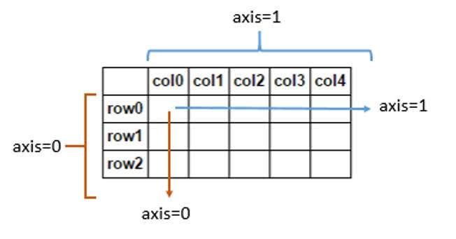

# Numpy-5 / 다차원 배열 다루기 1


axis = 0은 행을 따라서 움직인다(세로츅), axis = 1은 열을 따라서 움직인다(가로축)

##Numpy.amin
- 배열의 미니멈(최소) 값을 축을 따라서 반환 해주는 것
```python
np.amin(A, axis=0) // axis=0의 최소값을 출력, 축의 값에 따라 결과가 달라진다
```
전체 값을 반환하려면 축 값을 넣지 않으면 된다.

##Numpy.amax
- 배열의 맥시멈(최대) 값을 축을 따라서 반환 해주는 것
```python
np.amax(A, 0) // axis=0의 최대 값을 출력, 축의 값에 따라 결곽가 달라진다.
```

## numpy.ptp
- 'peak to peak', 최대 값과 최소 값의 범위를 보는 함수.
- 데이터의 크기가 커서 데이터의 형태를 볼 때 주로 사용
```python
np.ptp(A, 0) // 명령어를 입력하면 axis=0의 최대값과 최소값 사이의 범위를 출력한다.
```

## Numpy.median
- 배열의 중간 값을 축을 따라서 반환 해주는 함수
```python
np.median(A,0) // 해당 축의 가장 가운데 겂을 출력한다.
```
## Numpy.mean
- 산술 평균을 구하는 함수. 가중 평균을 구하려면 ** numpy.average를 사용해야한다.
```python
np.mean(A, 0)
```
## Numpy.var
- 지정된 축을 따라 분산을 계산.
- 분산이란 관측 값에서 평균을 뺀 값을 제곱하고, 그것을 모두 더한 후 전체 수로 나눠서 구한다. 즉, 차이값 제곱의 편균
```python
np.var(A, 0) // 축을 입력하지 않으면 전체 값에 대해 분산을 진행한다.
```

#Numpy.std
- 지정된 축을 따라서 표준 편차를 계산.
- 표준 편차란 분산을 제곱근 한 것을 말한다.
```python
np.std(A, 0) // 이런식으로 쓴다.
```
