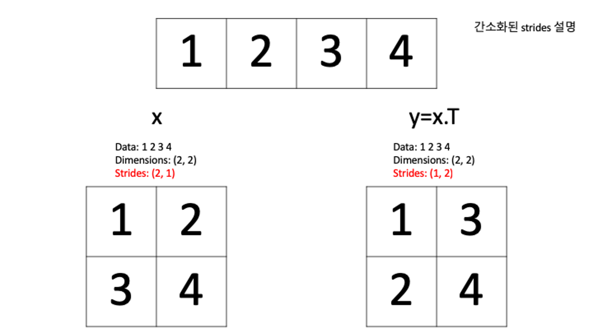

# Numpy -1
## 넘파이를 사용하는 이유
- 코어부분이 C언어로 구현되어 있어 동일한 연산을 하더라도 
Python에 비해 속도가 빠름.
- 라이브러리에 구현 되어 있는 함수들을 활여ㅛㅇ해 짧고 간결한 코드 작성 가능
- 효율적인 메모리 사용이 가능하도록 구현됨

## 넘파이 어레이가 리스트보다 빠른이유
파이썬 list가 느린이유
- 파이썬 리스트는 결국 포인터의 배열이다. 경우에 따라서 각 객체가 메모리 여기저기 흩어져 있기 때문에 캐시 활용이 어렵다.

넘파이 어레이가 빠른 이유
- 넘파이 어레이는 타입을 명시하여 원소의 배열로 데이터를 유지한다.
- 다차원 데이터도 연속된 메모리 공간이 할당됨
- 넘파이 어레이 구현방식을 떠올리면 어떻게 성능을 낼 수 있는지 상상이 가능하다.
- 많은 연산이 dimensions와 strides를 잘 활용하면 효율적으로 활용 가능

transpose : 대각선 기준으로 넘파이 어레이의 값을 뒤집는 것
 stride : n바이트를 건너뛰면서 값을 읽을것을 의미하며 괄호안에 값은 "(행, 열)"울 나타낸다.
 stride(2,1) 첫번째 값은 그대로 가져온다. 두칸 건너뛰어서 읽는다. 열이 바뀔때 한칸 건너뛴다.

transpose를 사용하는것보다 stride를 사용하는것이 더 빠르지만 굳이 그럴 필요까지는 없다.

